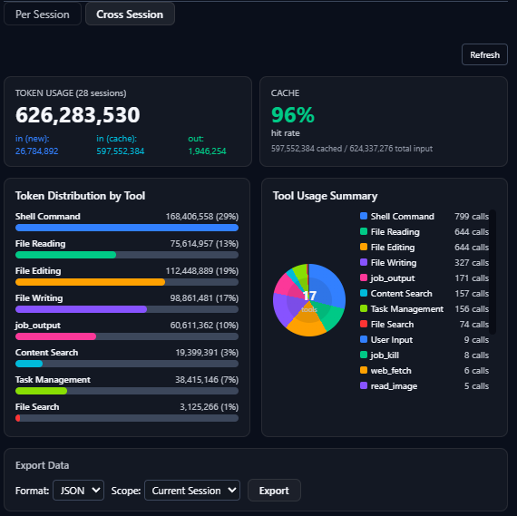
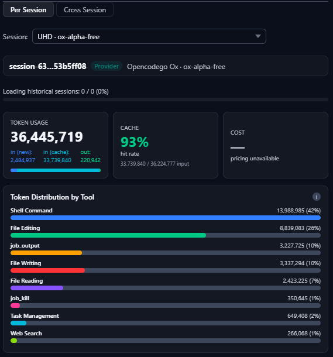
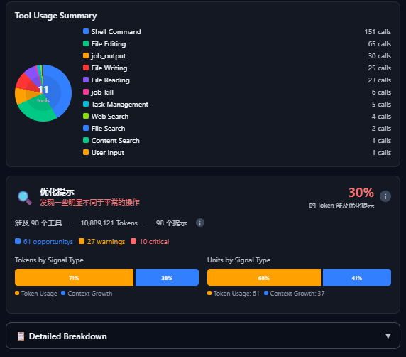
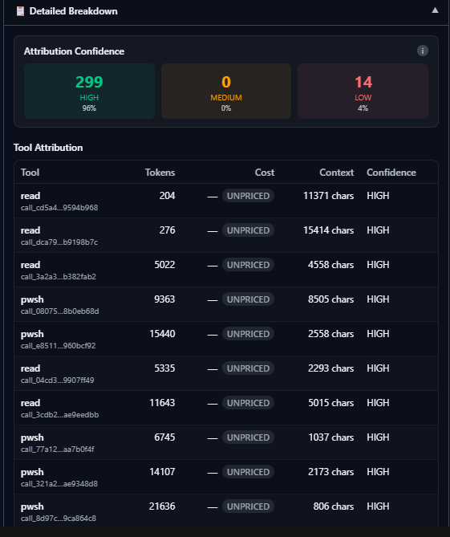
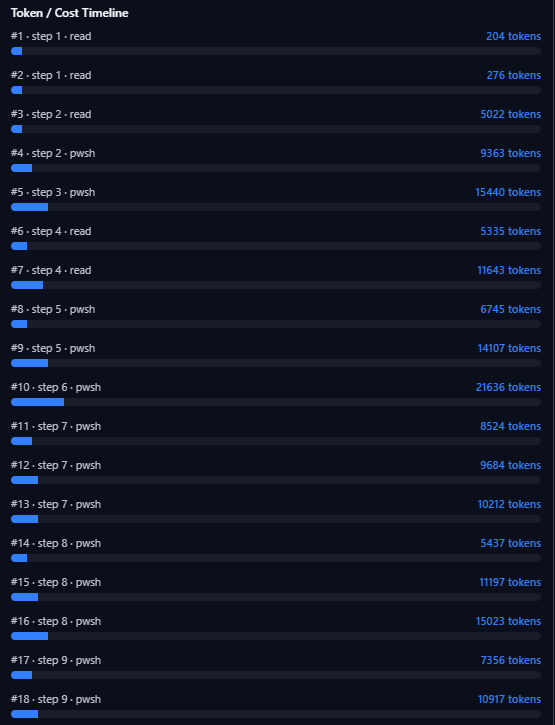
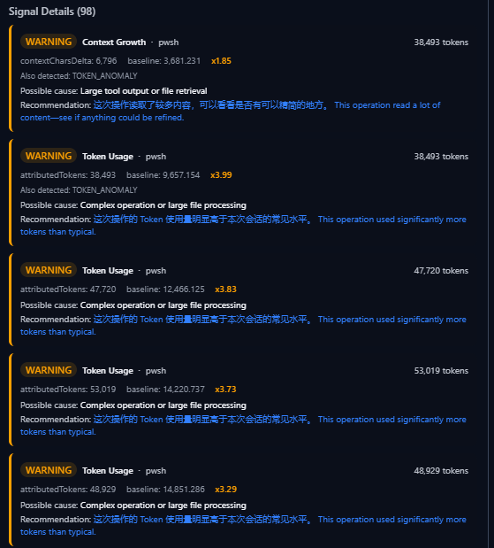

# Tokan — DSH Token Analytics

[English](#features) | [中文](#功能特性)

A [DeepSeek Harness (DSH)](https://github.com/deepseek-ai/deepseek-harness) plugin that adds a Token Analytics dashboard to the Web UI Settings panel: per-tool token attribution, cost breakdown, cache analysis, optimization signals, historical session replay, and JSON/CSV export.

[DeepSeek Harness (DSH)](https://github.com/deepseek-ai/deepseek-harness) 插件，在 Web 设置面板中提供 Token 分析仪表板：每个工具的 Token 归因、成本分解、缓存分析、优化信号、历史会话重放，以及 JSON/CSV 导出。

---

## Features

### Token Usage Dashboard

Real-time metrics for the selected session:

- **Total Tokens**: input + output
- **Input (New)**: tokens not served from cache
- **Input (Cache)**: tokens served from cache hits
- **Output**: generated tokens
- **Cache Hit Rate**: percentage of input from cache
- **Cost**: total cost (when pricing is available for the provider/model)

### Optimization Signals

Detects tool operations that deviate from the session's per-tool baseline:

| Severity | Threshold | Meaning |
|----------|-----------|---------|
| 💡 **OPPORTUNITY** | ≥1.5x AND ≥200 tokens | Possible optimization |
| 🟡 **WARNING** | ≥3.0x AND ≥800 tokens | Unusual operation |
| 🔴 **CRITICAL** | ≥6.0x AND ≥3000 tokens | Extreme operation |

Thresholds are fixed for consistent results (see `lib/waste.js`).

### Visual Analytics

- Token distribution by tool (horizontal bar chart)
- Tool usage summary (donut chart)
- Attribution confidence indicators (HIGH/MEDIUM/LOW)

### Historical Session Replay

On startup, the host half automatically replays persisted session logs and rebuilds every session's report. Each session is fully isolated — no cross-session contamination. Sessions with corrupt logs are skipped with a warning instead of aborting the restore.

### Cross-Session Summary

An aggregate view across all restored sessions: total tokens, cost, waste signals, and per-session comparison.

### Export Functionality

| Format | Scope |
|--------|-------|
| **JSON** | Current session / All sessions / Summary |
| **CSV** | Current session / All sessions / Summary |

### my-skin Integration

Optionally syncs with the [my-skin](https://github.com/fthuu/my-skin-for-DeepSeek-Harness) plugin's global saturation slider.

---

## 功能特性

### Token 使用仪表板

所选会话的实时指标：

- **总 Token 数**：输入 + 输出
- **输入（新）**：非缓存命中的 Token
- **输入（缓存）**：缓存命中的 Token
- **输出**：生成的 Token
- **缓存命中率**：输入中来自缓存的百分比
- **成本**：总成本（当提供商/模型定价可用时）

### 优化信号

检测偏离会话内工具基线的操作：

| 严重性 | 阈值 | 含义 |
|--------|------|------|
| 💡 **OPPORTUNITY** | ≥1.5x 且 ≥200 Token | 可能的优化机会 |
| 🟡 **WARNING** | ≥3.0x 且 ≥800 Token | 异常操作 |
| 🔴 **CRITICAL** | ≥6.0x 且 ≥3000 Token | 极端操作 |

阈值固定以确保结果一致（见 `lib/waste.js`）。

### 可视化分析

- 按工具的 Token 分布（水平柱状图）
- 工具使用摘要（环形图）
- 归因置信度指示器（高/中/低）

### 历史会话重放

启动时宿主半边自动重放持久化的会话日志，重建每个会话的报告。会话完全隔离，无跨会话污染。日志损坏的会话会带警告跳过，不会中断整体恢复。

### 跨会话摘要

所有已恢复会话的聚合视图：总 Token、成本、浪费信号与逐会话对比。

### 导出功能

| 格式 | 范围 |
|------|------|
| **JSON** | 当前会话 / 所有会话 / 摘要 |
| **CSV** | 当前会话 / 所有会话 / 摘要 |

### my-skin 集成

可选地与 [my-skin](https://github.com/fthuu/my-skin-for-DeepSeek-Harness) 插件的全局饱和度滑条同步


## Screenshots / 截图


### Cross Session



### Per Session



### Optimization Signals / 优化信号



### Attribution Details / 归因详情



### Token / Cost Timeline / Token 成本时间线



### Signal Details / 信号详情



---

## Installation / 安装

### Prerequisites / 前提条件

- [DeepSeek Harness (DSH)](https://github.com/deepseek-ai/deepseek-harness) installed, with its `dsh` CLI on PATH
- Node.js >= 22.19 or >= 24
- pnpm (the profile plugin manager forwards to it)

### Install into a DSH profile / 安装到 DSH profile

DSH loads plugins as profile bundles:

```bash
dsh plugin --profile web add github:fthuu/Tokan-dsh-token-analytics
```

`dsh plugin` initializes the profile on first use, runs `pnpm add` in the profile directory, and reconciles the `dsh.profile.bundles` list automatically. Then boot the Web GUI:

```bash
dsh web
```

Open the printed URL and find **Settings → General → Token Analytics**.

---

## Version History / 版本历史

See [CHANGELOG.md](CHANGELOG.md) for detailed version history. Latest: **v0.37.1**.

详细版本历史请查看 [CHANGELOG.md](CHANGELOG.md)。最新版本：**v0.37.1**。

---

## License / 许可证

This project is licensed under the GPL-3.0-only License - see the [LICENSE](LICENSE.txt) file for details.

本项目采用 GPL-3.0-only 许可证——详情请查看 [LICENSE](LICENSE.txt) 文件。

```
SPDX-License-Identifier: GPL-3.0-only
Copyright (c) 2026 fthuu
```

## Author

- Xiaohongshu/Rednote: @Epho
- GitHub: https://github.com/fthuu
